# Algoritmo Genético para o Problema do Caixeiro Viajante

Trabalho da disciplina de **Sistemas Inteligentes e Aprendizado de Máquina**.
O algoritmo genético foi implementado do zero em Python (só `random`, `math`, `time`, `csv` e `matplotlib`), seguindo os conceitos da aula de Algoritmos Genéticos: população, épocas, genótipo, seleção (Top Ranking), mistura (Ordered Crossover), mutação (Swap), função de aptidão e critérios de parada.

## Como executar

```bash
python3 -m venv .venv
source .venv/bin/activate
pip install -r requirements.txt

python testes.py                # verificações do algoritmo (permutação, ciclo, crossover, mutação...)
python main.py                  # roda os 3 experimentos com janela mostrando a melhor rota ao vivo
python main.py --sem-janela     # roda sem janela, só salva os resultados em resultados/
python comparar_parametros.py   # experimento extra: taxa de mutação e tamanho da população
```

## Arquivos

| Arquivo | Responsabilidade |
|---|---|
| `algoritmo_genetico.py` | Geração dos pontos, distância, indivíduo, população, aptidão, seleção, Ordered Crossover, Swap e o loop das épocas (com o registro de cada época) |
| `visualizacao.py` | Desenho da rota (janela ao vivo e imagens) e gráfico de convergência |
| `main.py` | Parâmetros (todos no topo do arquivo) e os três experimentos: aleatório, circular e bônus |
| `testes.py` | Verificações simples com `assert` |
| `comparar_parametros.py` | Experimento extra variando mutação e população no benchmark do círculo |
| `resultados/` | Imagens das rotas, gráficos de convergência e CSV com o histórico de todas as épocas |

---

## 1. Problema

Temos `n` pontos (cidades) em um plano 2D, cada um com coordenadas `(x, y)`. Queremos um caminho que:

- passe por **todos** os pontos exatamente uma vez;
- seja **cíclico**, ou seja, depois da última cidade volta para a primeira;
- tenha a **menor distância total possível**, usando a distância euclidiana:

```
d(A, B) = sqrt((xB - xA)² + (yB - yA)²)
```

A quantidade de pontos é configurável (mínimo de 8; o código lança erro se receber menos). O espaço de busca cresce muito rápido: para 20 cidades existem 19!/2 ≈ 6 × 10¹⁶ ciclos diferentes. Por isso não dá para testar todos, e usamos uma busca heurística como o algoritmo genético.

## 2. Como o indivíduo é representado

Seguindo o exemplo de "Listas" da aula, cada indivíduo (genótipo) é uma **lista com a ordem de visita das cidades**, ou seja, uma permutação dos índices `0..n-1`:

```
[3, 0, 6, 2, 7, 1, 5, 4]
```

significa: começa na cidade 3, vai para a 0, depois a 6, ..., chega na 4 e **volta para a 3**.

Cada cidade tem que aparecer **exatamente uma vez**. Se uma cidade se repetisse, outra ficaria de fora, e o caminho não seria mais uma solução do problema. A vantagem dessa representação é que a restrição "visitar todas uma única vez" fica **dentro da própria genética**, como a aula recomenda ("eventuais restrições devem estar na função objetivo ou na genética dos indivíduos"). Não precisamos penalizar soluções inválidas, porque elas nunca são geradas.

Não usamos genes binários porque a ordem das cidades é a informação que importa, e uma lista 1D de inteiros representa isso diretamente.

## 3. População

- **Tamanho:** `POPULATION_SIZE = 100`, fixo durante toda a execução (a nova geração sempre tem 100 indivíduos).
- **População inicial:** 100 permutações aleatórias (`random.shuffle`).

Por que 100? A aula mostra que a quantidade de soluções avaliadas é aproximadamente **épocas × população**, e que uma população maior dá mais **variedade genética** (ajuda a evitar mínimos locais), mas custa mais **tempo e memória por época**. Com 100 indivíduos e até 500 épocas avaliamos até 50.000 rotas, o que roda em menos de 1 segundo para 20 pontos.

Testamos isso na prática com o `comparar_parametros.py` (círculo de 20 pontos, 10 execuções com seeds diferentes para cada tamanho, mutação de 5%):

| População | Mutação | Achou o ótimo | Erro médio | Épocas (média) | Tempo (média) |
|---|---|---|---|---|---|
| 20 | 5% | 0/10 | 75.99% | 293 | 0.024 s |
| 50 | 5% | 8/10 | 7.29% | 282 | 0.057 s |
| 100 | 5% | 8/10 | 12.91% | 191 | 0.077 s |
| 200 | 5% | 10/10 | 0.00% | 147 | 0.120 s |
| 500 | 5% | 10/10 | 0.00% | 162 | 0.330 s |

Com população 20 a variedade genética é tão pequena que o algoritmo nunca chegou no ótimo. A partir de 50–100 ele já acerta na maioria das vezes, e com 200 ou mais acertou sempre, mas o tempo por execução cresce junto com a população (500 indivíduos custaram ~4× mais que 100). Mantivemos 100 como meio-termo: valor fácil de justificar, rápido e com boa taxa de acerto. A constante fica no topo do `main.py` para quem quiser testar outros valores.

## 4. Função de aptidão

Seguindo o exemplo do caixeiro viajante dado na aula, a aptidão de um indivíduo `I` com `n` cidades é a **distância total do ciclo**:

```
F(I) = [ d(I[0], I[1]) + d(I[1], I[2]) + ... + d(I[n-2], I[n-1]) ] + d(I[n-1], I[0])
```

A primeira parte é a soma das distâncias entre cidades consecutivas. A última parcela é a **volta da última cidade para a primeira**, que é o que torna o caminho cíclico. Exemplo para `[0, 3, 2, 1]`: soma `0→3`, `3→2`, `2→1` e `1→0`.

No código, isso é a função `distancia_total(individuo, pontos)`.

Apesar do nome "aptidão", aqui o valor é um **custo a ser MINIMIZADO**: **menor distância = melhor indivíduo**. Não fizemos nenhuma transformação (como `1/distância`), porque não precisa: basta ordenar a população da menor para a maior distância (função `ranking`).

## 5. Seleção

Usamos **Top Ranking**, que foi apresentado na aula:

1. calcula a distância de todos os indivíduos;
2. ordena do melhor (menor distância) para o pior;
3. os **50% melhores** (`SELECTION_RATE = 0.5`, ou seja, 50 indivíduos) formam o grupo que pode se reproduzir;
4. para gerar cada filho, **sorteamos dois pais** dentro desse grupo.

Por que Top Ranking?

- É o método mais simples entre os apresentados e mantém o **tamanho da população controlado**, como diz a aula.
- Indivíduos melhores têm mais oportunidade de passar seus genes. Os 50% piores não se reproduzem.
- Sorteamos os pares entre os selecionados para que os filhos não venham todos do mesmo casal. Isso mantém soluções variadas. A aula mostra que a estratégia "Alpha" (o melhor cruza com todos) tende a ficar presa em mínimo local justamente porque a geração inteira fica parecida.

Além disso, usamos **elitismo simples** (a ideia de "sobreviventes" da aula): o melhor indivíduo da geração atual é copiado direto para a próxima. Assim a melhor solução encontrada nunca se perde. Por causa disso, a "melhor distância da época" e a "melhor distância até agora" acabam sempre iguais. As duas são registradas mesmo assim.

## 6. Cruzamento (Ordered Crossover)

### Por que não usar o crossover comum?

No crossover de "metades" (primeira metade de um pai + segunda metade do outro), as cidades se repetem:

```
Pai A: [0, 1, 2, 3 | 4, 5, 6, 7]
Pai B: [4, 6, 1, 0 | 7, 3, 5, 2]

Filho: [0, 1, 2, 3,  7, 3, 5, 2]   <- 3 e 2 aparecem duas vezes; 4 e 6 sumiram
```

Esse filho não é uma rota válida. O mesmo acontece com o Uniform Crossover. Como diz a aula, no caixeiro viajante é preciso garantir que um mesmo valor não apareça em posições diferentes, e para isso existe o **Ordered Crossover**.

### Como funciona o nosso

1. Sorteamos dois pontos de corte `inicio` e `fim`.
2. O trecho `pai1[inicio:fim]` é copiado para o filho **na mesma posição**.
3. Percorremos o `pai2` da esquerda para a direita e pegamos, **na ordem**, as cidades que ainda não estão no filho.
4. Essas cidades preenchem as posições livres do filho, da esquerda para a direita.

Exemplo (cortes nas posições 2 e 5):

```
Pai A: [0, 1, | 2, 3, 4, | 5, 6, 7]       trecho copiado: [2, 3, 4]
Pai B: [4, 6, 1, 0, 7, 3, 5, 2]           sem 2, 3 e 4, na ordem: [6, 1, 0, 7, 5]

Filho: [6, 1, | 2, 3, 4, | 0, 7, 5]
```

O exemplo do slide da aula é exatamente esse procedimento com o corte na metade (`inicio = 0`, `fim = n/2`): `A E C B F D` + `A D C E B F` → `A E C D B F`. Esse caso está nos testes (`testar_crossover_exemplo_da_aula`).

O filho é **sempre uma permutação válida**: o trecho do pai A não tem repetições, e do pai B só entram as cidades que ainda faltam, cada uma uma vez. O filho herda um **pedaço de caminho** do pai A e a **ordem relativa** das outras cidades do pai B.

**Detalhe que descobrimos testando:** na primeira versão, colocávamos o trecho do pai A sempre no **começo** do filho. Isso parecia indiferente (o caminho é cíclico), mas não é: com dois pais **iguais**, o filho saía diferente e com a rota quebrada (ex.: `[0..7]` com trecho `[2,3,4]` virava `[2,3,4,0,1,5,6,7]`). O cruzamento destruía as boas rotas, a média da população não convergia, e no círculo de 20 pontos o algoritmo parou com 9,75% de erro. Mantendo o trecho na mesma posição, pais iguais geram um filho igual (está nos testes), e o mesmo cenário passou a chegar no ótimo.

## 7. Mutação (Swap)

Usamos a **Swap Mutation**, que a aula apresenta como "a forma mais simples": sorteamos duas posições e trocamos os genes de lugar.

```
antes:  [0, 1, 2, 3, 4, 5]
troca das posições 1 e 4
depois: [0, 4, 2, 3, 1, 5]
```

Como só trocamos duas cidades de lugar, o resultado continua sendo uma permutação válida.

**Taxa: `MUTATION_RATE = 0.05`** (5% de chance de um novo filho sofrer uma mutação), que é o próprio valor usado de exemplo na aula.

- A mutação perturba a genética para **escapar de mínimos locais**: ela cria rotas que o cruzamento sozinho não geraria, porque o crossover só recombina o que já existe na população.
- Taxa **alta demais** perturba demais a busca e destrói as características boas que a seleção encontrou; a busca fica parecida com uma busca aleatória.
- Taxa **baixa demais** demora a gerar mudanças significativas, e a população fica presa quando todos os indivíduos ficam parecidos.

O `comparar_parametros.py` confirma isso no benchmark do círculo (20 pontos, população 100, 10 seeds):

| População | Mutação | Achou o ótimo | Erro médio | Épocas (média) | Tempo (média) |
|---|---|---|---|---|---|
| 100 | 0% | 2/10 | 23.29% | 135 | 0.054 s |
| 100 | 1% | 5/10 | 14.88% | 162 | 0.065 s |
| 100 | 5% | 8/10 | 12.91% | 191 | 0.077 s |
| 100 | 20% | 10/10 | 0.00% | 164 | 0.069 s |
| 100 | 50% | 10/10 | 0.00% | 214 | 0.095 s |
| 100 | 100% | 0/10 | 84.76% | 259 | 0.125 s |

Sem mutação (0%), o algoritmo para cedo (135 épocas) num mínimo local. Com 100% (todo filho é perturbado), ele nunca consegue consolidar uma rota boa e erra em média 85%. Os valores intermediários funcionam bem. Mantivemos **5%** por ser o valor da aula e porque já acerta o ótimo na maioria das execuções. Neste problema, 20% foi ainda melhor, o que mostra que vale a pena ajustar a taxa para cada problema.

## 8. Critério de parada

A aula lista: quantidade de épocas, variação no ganho entre épocas, meta mínima de score e combinações. Usamos a combinação de dois (para no **primeiro** que acontecer):

- **Máximo de épocas** (`MAX_GENERATIONS = 500`): garante que o algoritmo não roda indefinidamente.
- **Estagnação** (`MAX_STAGNATION = 100`): se a melhor distância não melhorar por 100 épocas seguidas, paramos. É o critério de "variação no ganho entre épocas": não adianta gastar processamento se não há ganho. Só consideramos melhora se `nova_distancia < melhor_distancia - 1e-9`, para evitar problemas de ponto flutuante.

Não usamos "meta mínima" porque no cenário aleatório não sabemos qual é o ótimo. Nos dois cenários de 20 pontos, quem parou o algoritmo foi a estagnação (193 e 290 épocas), bem antes do limite de 500.

## 9. Fluxo do algoritmo

Segue o fluxo geral da aula (função `executar_algoritmo_genetico`):

1. criar a população inicial aleatória (época 0);
2. calcular a aptidão (distância) de todos e **ordenar** (ranking);
3. registrar os dados da época e verificar os **critérios de parada**;
4. **selecionar** os 50% melhores como pais;
5. colocar o melhor indivíduo direto na nova geração (elitismo);
6. até completar 100 indivíduos: sortear dois pais, **cruzar** (Ordered Crossover) e, com 5% de chance, **mutar** (Swap);
7. a nova geração substitui a antiga;
8. repetir a partir do passo 2 (cada repetição é uma **época**).

### Acompanhamento de cada época

Em **toda** época são registrados, em listas: o número da época, a melhor distância da época, a melhor distância até agora, a distância média da população e o melhor indivíduo até agora. O terminal mostra uma linha por época:

```
Epoca 0 | Melhor: 710.50 | Media: 1048.59
Epoca 1 | Melhor: 710.50 | Media: 1004.81
...
```

Esse histórico completo (incluindo a melhor rota de cada época) é salvo em `resultados/aleatorio_historico.csv` e `resultados/circular_historico.csv`.

Com `python main.py` abre uma janela que redesenha a melhor rota a cada `VISUAL_UPDATE_INTERVAL = 10` épocas (título com cenário, época e melhor distância). Para ver literalmente toda época na apresentação, basta mudar para `VISUAL_UPDATE_INTERVAL = 1`. O redesenho não afeta o registro: os dados numéricos são sempre guardados em todas as épocas.

## 10. Experimento aleatório

- **Pontos:** 20, uniformemente distribuídos com `random.uniform(0, 100)` em x e y
- **Seed:** 42 (os mesmos pontos e o mesmo resultado em toda execução)
- **Parâmetros:** população 100, seleção 50%, mutação 5%, máx. 500 épocas, estagnação 100

**Resultado obtido:**

| Medida | Valor |
|---|---|
| Distância da melhor rota | **352.32** |
| Melhor rota | `[11, 4, 0, 9, 3, 12, 19, 14, 18, 10, 15, 2, 7, 16, 17, 8, 5, 6, 13, 1]` |
| Épocas executadas | 193 (parou por estagnação) |
| Época da última melhoria | 93 |
| Tempo total | 0.08 s |
| Tempo até a última melhoria | 0.04 s |

Evolução da melhor distância e da média da população:

| Época | Melhor | Média |
|---|---|---|
| 0 (aleatória) | 710.50 | 1048.59 |
| 10 | 586.57 | 812.75 |
| 50 | 387.82 | 406.36 |
| 100 | 352.32 | 359.48 |
| 193 (final) | 352.32 | 358.12 |

A melhor rota caiu de 710.50 para 352.32, uma redução de 50,4% em relação à melhor rota da população inicial (e de 66,4% em relação à média inicial). A rota final não tem nenhum cruzamento de arestas.

| Rota inicial (época 0) | Rota final (época 193) |
|---|---|
| 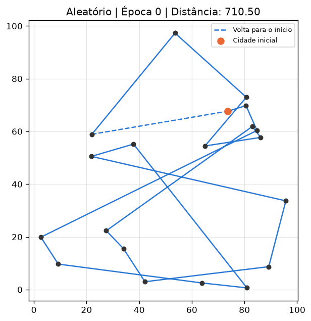 | 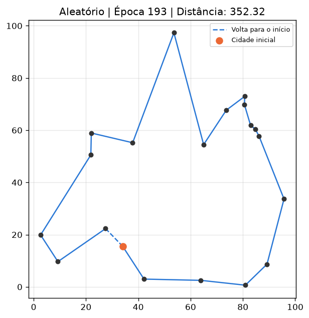 |

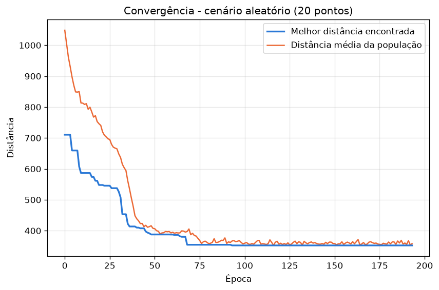

No gráfico de convergência, a média da população cai junto com a melhor e encosta nela por volta da época 75: a população inteira foi puxada para rotas boas.

## 11. Experimento circular (benchmark)

- **Pontos:** 20, igualmente espaçados numa circunferência de **raio 40** e centro (50, 50) (`angulo = 2πi/n`)
- **Parâmetros:** os mesmos do cenário aleatório (seed 42)

Esse cenário é um benchmark porque sabemos qual é a melhor rota: percorrer os pontos em ordem ao redor do círculo. Ela forma um polígono regular, então a distância ótima é:

```
lado = 2 · R · sin(π/n)
distancia_otima = n · lado = 20 · 2 · 40 · sin(π/20) = 250.30
```

O algoritmo **não sabe** disso; ele começa de rotas aleatórias como no outro cenário.

**Resultado obtido:**

| Medida | Valor |
|---|---|
| Distância encontrada pelo AG | **250.30** |
| Distância ótima teórica | **250.30** |
| Diferença absoluta | 0.00 |
| Erro percentual | **0.00%** |
| Melhor rota | `[13, 14, 15, 16, 17, 18, 19, 0, 1, 2, ..., 12]` (todas em ordem) |
| Épocas executadas | 290 (parou por estagnação) |
| Época da última melhoria | 190 |
| Tempo total | 0.12 s |
| Tempo até a última melhoria | 0.08 s |

| Época | Melhor | Média |
|---|---|---|
| 0 (aleatória) | 815.40 | 1081.46 |
| 10 | 584.37 | 813.55 |
| 50 | 405.15 | 425.54 |
| 100 | 376.92 | 385.00 |
| 290 (final) | 250.30 | 257.04 |

O AG encontrou exatamente a rota ótima: começa na cidade 13 e segue a circunferência, o que é a mesma volta (o ciclo pode começar em qualquer cidade).

| Rota inicial (época 0) | Rota final (época 290) |
|---|---|
| 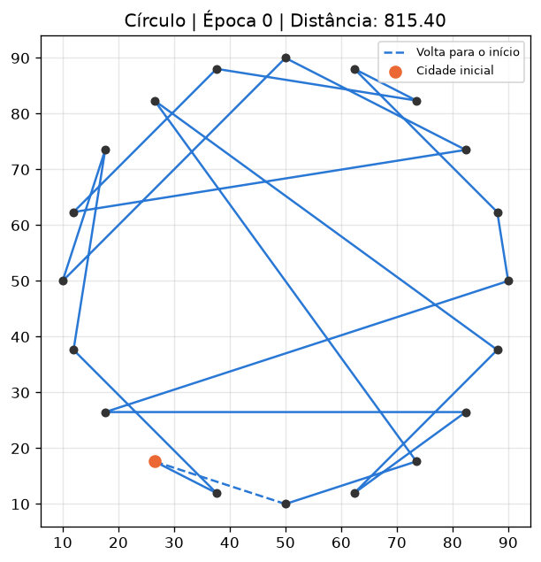 | 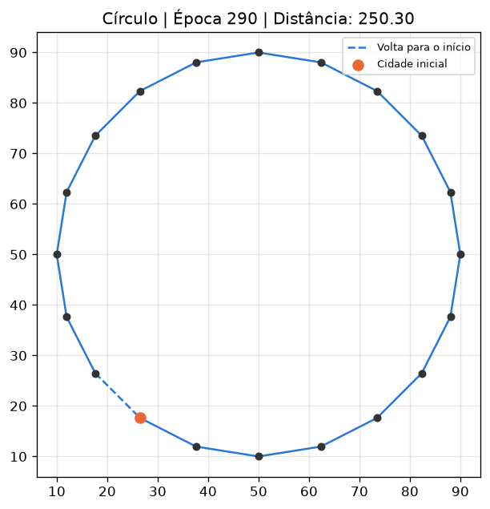 |

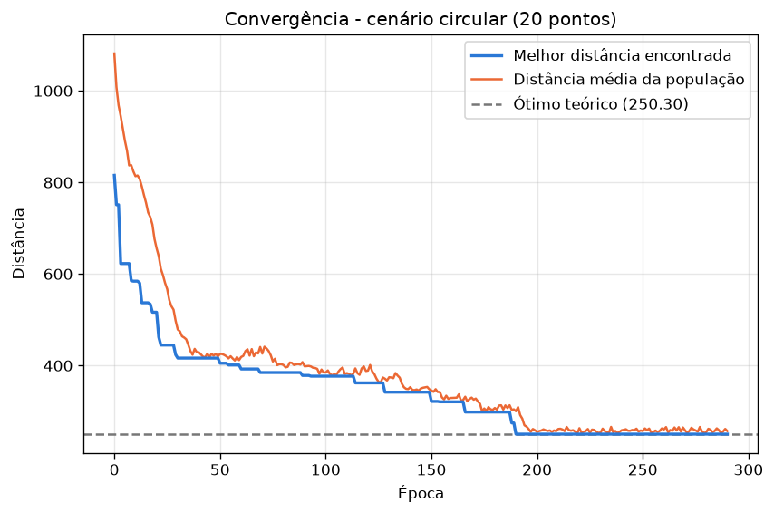

No gráfico aparecem "degraus": a melhor distância fica parada por várias épocas (por exemplo, entre as épocas ~130 e ~150) até que um cruzamento ou mutação encontra uma rota melhor. Os dois últimos degraus (época 188: 298.51 → 274.71; época 190: 274.71 → 250.30) levam ao ótimo (linha tracejada). Para lembrar: com seeds diferentes, essa mesma configuração achou o ótimo em 8 de 10 execuções (tabela da seção 7). Esta execução com seed 42 foi uma das que acertaram.

## 12. Bônus: círculo com 100 pontos

- **Pontos:** 100 no círculo de raio 40 (`N_POINTS_BONUS = 100`)
- **Parâmetros genéticos:** os mesmos (população 100, seleção 50%, mutação 5%)
- **Parada:** máx. 20.000 épocas e estagnação de 2.000 épocas. Com 100 cidades o algoritmo precisa de muito mais épocas para refinar a solução (como diz a aula, mais épocas permitem refinar), então aumentamos esses dois limites só para o bônus.
- Tempo medido com `time.perf_counter()`.

**Resultado obtido:**

| Medida | Valor |
|---|---|
| Distância encontrada | **656.85** |
| Distância ótima teórica | 251.29 |
| Diferença absoluta | 405.56 |
| Erro percentual | **161.40%** |
| Épocas executadas | 10.842 (parou por estagnação) |
| Época da última melhoria (convergência) | 8.842 |
| Tempo total | 14.35 s |
| **Tempo até a convergência** (última melhoria) | **11.72 s** |

Soluções intermediárias:

| Época | Melhor distância |
|---|---|
| 0 | 4496.30 |
| 10 | 3799.61 |
| 50 | 2711.65 |
| 100 | 2055.43 |
| 1000 | 1006.38 |
| 5000 | 703.56 |
| 10842 (final) | 656.85 |

| Época 0 | Época 10 | Época 50 |
|---|---|---|
| 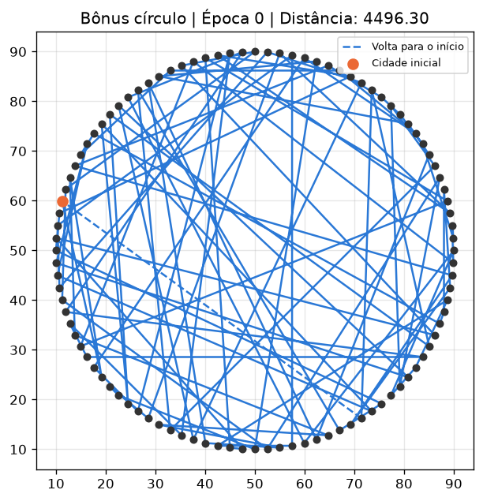 | 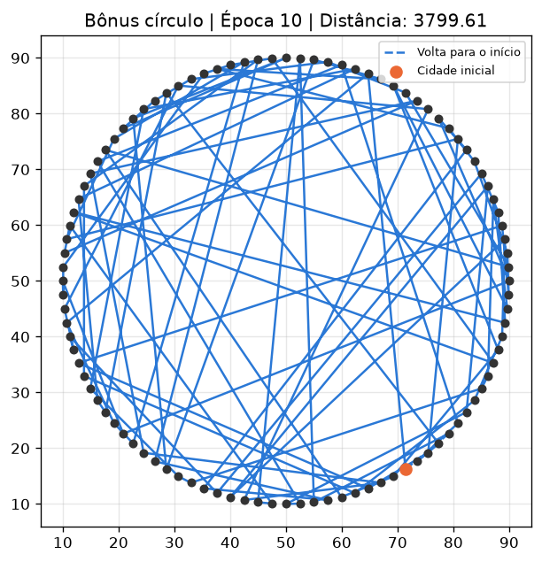 | 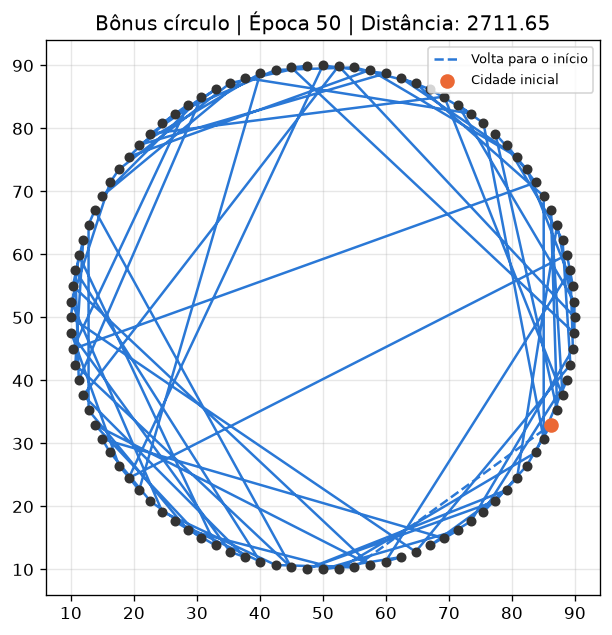 |

| Época 100 | Final (época 10842) |
|---|---|
| 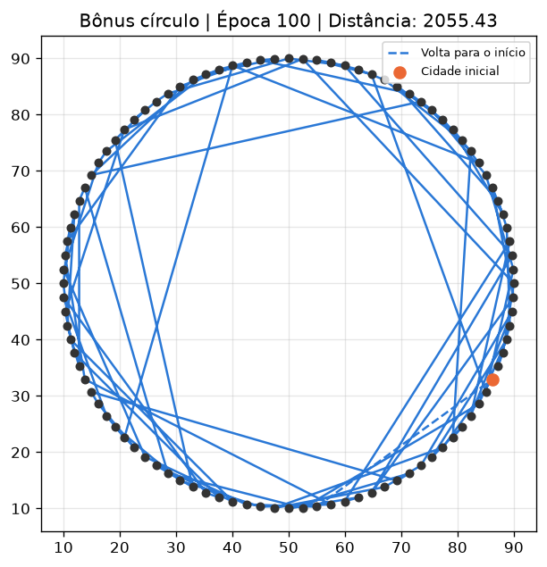 | 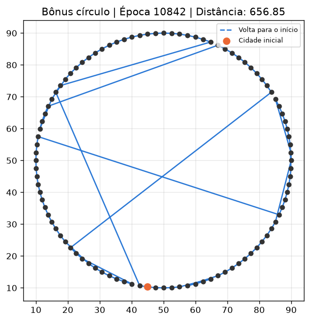 |

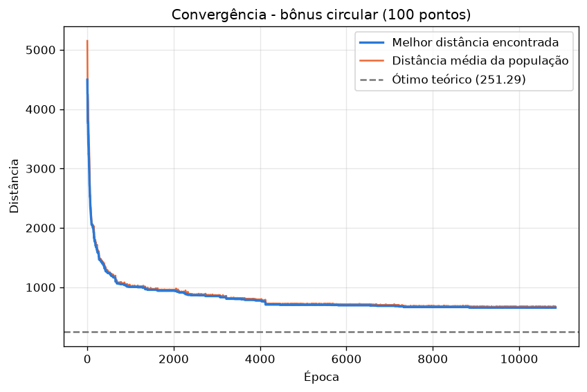

**Análise.** Dá para ver a rota totalmente confusa da época 0 se organizando: na época 100 já aparecem vários arcos seguindo o círculo, e na final quase todo o caminho segue a circunferência. Só sobram algumas "cordas" longas cruzando o círculo. Elas são **trechos percorridos na ordem invertida**. Para consertar um trecho invertido seria preciso inverter um bloco inteiro de cidades, o que exige várias trocas (Swap) coordenadas. Cada troca isolada costuma **piorar** a rota, então a seleção a descarta antes que a próxima troca aconteça.

Também se vê no gráfico que, a partir da época ~100, a média da população praticamente encosta na melhor distância (2082 contra 2055 na época 100). A população ficou quase toda igual, e o cruzamento de indivíduos iguais não gera nada novo. A partir daí o progresso depende quase só da mutação, por isso fica tão lento. Testamos rapidamente população 200 e mutação de 20% para esse cenário, e o erro continuou entre 149% e 160%.

Conclusão do bônus: o AG simples, com Ordered Crossover e Swap, acha o ótimo com 20 pontos, mas não escala bem para 100. O espaço de busca passa de ~10¹⁶ para ~10¹⁵⁵ ciclos, e os operadores simples não bastam para sair desses mínimos locais. Melhorar isso exigiria populações bem maiores ou outros operadores, o que fica fora do escopo deste trabalho.

> Os tempos foram medidos neste computador com `--sem-janela`. Em outras máquinas os tempos mudam, mas como a seed é fixa as distâncias e as épocas são exatamente as mesmas.

## 13. Parâmetros utilizados

Todos ficam no topo do `main.py`.

| Parâmetro | Valor |
|---|---|
| Seed (`SEED`) | 42 |
| População (`POPULATION_SIZE`) | 100 |
| Seleção, Top Ranking (`SELECTION_RATE`) | 50% melhores |
| Elitismo | 1 indivíduo (o melhor) |
| Cruzamento | Ordered Crossover (2 cortes aleatórios) |
| Mutação | Swap |
| Taxa de mutação (`MUTATION_RATE`) | 5% |
| Máximo de épocas (`MAX_GENERATIONS`) | 500 |
| Máximo de estagnação (`MAX_STAGNATION`) | 100 |
| Pontos no cenário aleatório (`N_POINTS_RANDOM`) | 20 |
| Pontos no cenário circular (`N_POINTS_CIRCLE`) | 20 |
| Raio do círculo (`CIRCLE_RADIUS`) | 40 |
| Pontos no bônus (`N_POINTS_BONUS`) | 100 |
| Máximo de épocas no bônus (`MAX_GENERATIONS_BONUS`) | 20.000 |
| Máximo de estagnação no bônus (`MAX_STAGNATION_BONUS`) | 2.000 |
| Atualização da janela (`VISUAL_UPDATE_INTERVAL`) | a cada 10 épocas |

## 14. Conclusão

- **Evolução das soluções:** nos três experimentos a melhor distância cai rápido nas primeiras épocas e depois melhora em "degraus" cada vez mais espaçados, até estagnar. A média da população acompanha a melhor, o que mostra a seleção concentrando a população em rotas boas.
- **Papel do crossover:** é o principal motor da melhora. O Ordered Crossover junta um pedaço de caminho de um pai com a ordem das cidades do outro, sempre gerando uma rota válida. Vimos na prática que o detalhe de manter o trecho na mesma posição é essencial para não destruir as boas rotas.
- **Papel da mutação:** traz novidade quando a população fica parecida. Sem mutação o algoritmo travou cedo (achou o ótimo em 2 de 10 execuções); com mutação demais (100%) ele não consolidou nada (0 de 10).
- **Cenário aleatório:** a rota final (352.32) é 50% mais curta que a melhor rota inicial e não tem cruzamentos, em 0.08 s.
- **Cenário circular:** o AG encontrou **exatamente o ótimo teórico** (250.30, erro 0.00%) em 290 épocas. Isso mostra que a implementação está correta e funciona.
- **Benchmark com muitos pontos:** com 100 pontos o algoritmo melhorou a rota de 4496.30 para 656.85 em ~12 s, mas ficou 161% acima do ótimo. O benchmark do círculo deixa claro o limite do AG simples: ele funciona muito bem para poucos pontos, e com muitos pontos fica preso em mínimos locais que o Swap não consegue desfazer.
